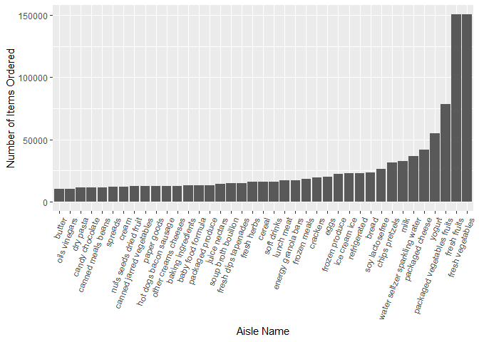

p8105_revisions_hw3_dmb2257
================
Diane Benites
2025-11-21

# Problem 1

This loads necessary packages and the dataset.

``` r
library(p8105.datasets)
library(tidyverse)
```

    ## ── Attaching core tidyverse packages ──────────────────────── tidyverse 2.0.0 ──
    ## ✔ dplyr     1.1.4     ✔ readr     2.1.5
    ## ✔ forcats   1.0.0     ✔ stringr   1.5.2
    ## ✔ ggplot2   3.5.2     ✔ tibble    3.3.0
    ## ✔ lubridate 1.9.4     ✔ tidyr     1.3.1
    ## ✔ purrr     1.1.0     
    ## ── Conflicts ────────────────────────────────────────── tidyverse_conflicts() ──
    ## ✖ dplyr::filter() masks stats::filter()
    ## ✖ dplyr::lag()    masks stats::lag()
    ## ℹ Use the conflicted package (<http://conflicted.r-lib.org/>) to force all conflicts to become errors

``` r
data("instacart")
```

Description of the Instacart Dataset: There are 1384617 observations of
15 variables. Each column represents one of the variables in the
dataset. Each row represents one product of an order. This data provides
information on when instacart orders in the sample were placed, which
products were ordered, the frequency of orders, and the aisles
associated with the orders.

``` r
items_ordered_df =
instacart|>
  janitor::clean_names()|>
  group_by(aisle_id, aisle)|>
  summarize(
    item_order_count=n())|>
  arrange(desc(item_order_count))
```

    ## `summarise()` has grouped output by 'aisle_id'. You can override using the
    ## `.groups` argument.

There are 134 aisles. The most items are ordered from aisle 83: fresh
vegetables (150609 items ordered), aisle 24: fresh fruits (150473 items
ordered), and aisle 123: packaged vegatables (78493 items ordered).

This makes a plot of the number of items ordered. The aisles are sorted
by the number of items ordered. The names of the aisles are included on
the x axis.

``` r
items_ordered_df|>
  filter(item_order_count >= 10000)|>
  ggplot(
    aes(fct_reorder(aisle, item_order_count), item_order_count))+
  geom_col()+
  labs(
    x = "Aisle Name",
    y = "Number of Items Ordered"
  )+
  theme(axis.text.x = element_text(angle = 70, hjust =1))
```

<!-- -->

This creates a table of the 3 most popular items in the aisles “baking
ingredients”, “dog food care”, “packaged vegetables fruits”, and how
many of each item was ordered.

``` r
instacart|>
  filter(aisle %in% c("baking ingredients", "dog food care", "packaged vegetables fruits"))|>
  group_by(aisle, product_name)|>
  summarize(
    product_count = n()
  )|>
  arrange(desc(product_count))|>
  filter(min_rank(desc(product_count))< 4)|>
  knitr::kable()
```

    ## `summarise()` has grouped output by 'aisle'. You can override using the
    ## `.groups` argument.

| aisle | product_name | product_count |
|:---|:---|---:|
| packaged vegetables fruits | Organic Baby Spinach | 9784 |
| packaged vegetables fruits | Organic Raspberries | 5546 |
| packaged vegetables fruits | Organic Blueberries | 4966 |
| baking ingredients | Light Brown Sugar | 499 |
| baking ingredients | Pure Baking Soda | 387 |
| baking ingredients | Cane Sugar | 336 |
| dog food care | Snack Sticks Chicken & Rice Recipe Dog Treats | 30 |
| dog food care | Organix Chicken & Brown Rice Recipe | 28 |
| dog food care | Small Dog Biscuits | 26 |

This makes a table showing the mean hour of the day at which pank lady
apples and coffee ice cream were ordered.

``` r
instacart |>
  mutate(
    order_dow = 
      case_match(
        order_dow,
        0 ~ "Sunday",
        1 ~ "Monday",
        2 ~ "Tuesday",
        3 ~ "Wednesday",
        4 ~ "Thursday",
        5 ~ "Friday",
        6 ~ "Saturday"),
    order_dow = as.factor(order_dow))|>
  group_by(product_name, order_dow)|>
  summarize(
    mean_hour = mean(order_hour_of_day, na.rm = TRUE)
  )|>
  filter(
    product_name %in% c("Pink Lady Apples", "Coffee Ice Cream"))|>
  pivot_wider(
    names_from = order_dow,
    values_from = mean_hour)|>
  knitr::kable()
```

    ## `summarise()` has grouped output by 'product_name'. You can override using the
    ## `.groups` argument.

| product_name | Friday | Monday | Saturday | Sunday | Thursday | Tuesday | Wednesday |
|:---|---:|---:|---:|---:|---:|---:|---:|
| Coffee Ice Cream | 12.26316 | 14.31579 | 13.83333 | 13.77419 | 15.21739 | 15.38095 | 15.31818 |
| Pink Lady Apples | 12.78431 | 11.36000 | 11.93750 | 13.44118 | 11.55172 | 11.70213 | 14.25000 |

# Problem 2

# Problem 3
