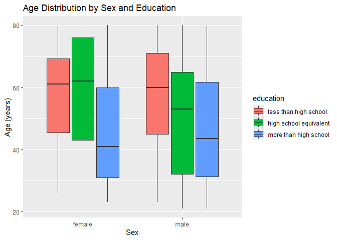
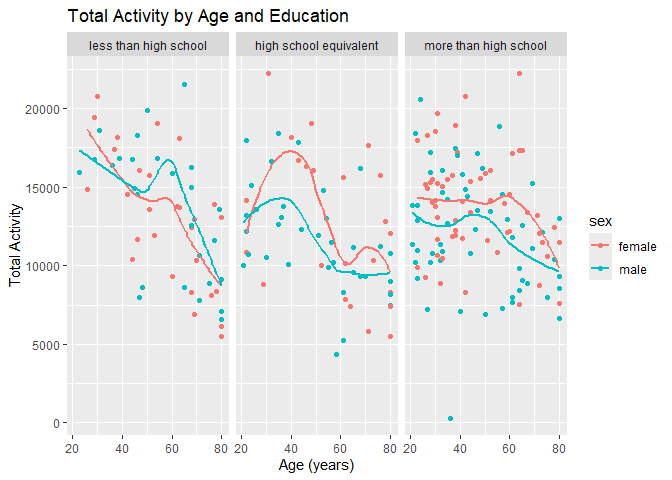

p8105_revisions_hw3_dmb2257
================
Diane Benites
2025-11-21

# Problem 1

This loads necessary packages and the dataset.

``` r
library(p8105.datasets)
library(tidyverse)
```

    ## ── Attaching core tidyverse packages ──────────────────────── tidyverse 2.0.0 ──
    ## ✔ dplyr     1.1.4     ✔ readr     2.1.5
    ## ✔ forcats   1.0.0     ✔ stringr   1.5.2
    ## ✔ ggplot2   3.5.2     ✔ tibble    3.3.0
    ## ✔ lubridate 1.9.4     ✔ tidyr     1.3.1
    ## ✔ purrr     1.1.0     
    ## ── Conflicts ────────────────────────────────────────── tidyverse_conflicts() ──
    ## ✖ dplyr::filter() masks stats::filter()
    ## ✖ dplyr::lag()    masks stats::lag()
    ## ℹ Use the conflicted package (<http://conflicted.r-lib.org/>) to force all conflicts to become errors

``` r
data("instacart")
```

Description of the Instacart Dataset: There are 1384617 observations of
15 variables. Each column represents one of the variables in the
dataset. Each row represents one product of an order. This data provides
information on when instacart orders in the sample were placed, which
products were ordered, the frequency of orders, and the aisles
associated with the orders.

``` r
items_ordered_df =
instacart|>
  janitor::clean_names()|>
  group_by(aisle_id, aisle)|>
  summarize(
    item_order_count=n())|>
  arrange(desc(item_order_count))
```

    ## `summarise()` has grouped output by 'aisle_id'. You can override using the
    ## `.groups` argument.

There are 134 aisles. The most items are ordered from aisle 83: fresh
vegetables (150609 items ordered), aisle 24: fresh fruits (150473 items
ordered), and aisle 123: packaged vegatables (78493 items ordered).

This makes a plot of the number of items ordered. The aisles are sorted
by the number of items ordered. The names of the aisles are included on
the x axis.

``` r
items_ordered_df|>
  filter(item_order_count >= 10000)|>
  ggplot(
    aes(fct_reorder(aisle, item_order_count), item_order_count))+
  geom_col()+
  labs(
    x = "Aisle Name",
    y = "Number of Items Ordered"
  )+
  theme(axis.text.x = element_text(angle = 70, hjust =1))
```

<!-- -->

This creates a table of the 3 most popular items in the aisles “baking
ingredients”, “dog food care”, “packaged vegetables fruits”, and how
many of each item was ordered.

``` r
instacart|>
  filter(aisle %in% c("baking ingredients", "dog food care", "packaged vegetables fruits"))|>
  group_by(aisle, product_name)|>
  summarize(
    product_count = n()
  )|>
  arrange(desc(product_count))|>
  filter(min_rank(desc(product_count))< 4)|>
  knitr::kable()
```

    ## `summarise()` has grouped output by 'aisle'. You can override using the
    ## `.groups` argument.

| aisle | product_name | product_count |
|:---|:---|---:|
| packaged vegetables fruits | Organic Baby Spinach | 9784 |
| packaged vegetables fruits | Organic Raspberries | 5546 |
| packaged vegetables fruits | Organic Blueberries | 4966 |
| baking ingredients | Light Brown Sugar | 499 |
| baking ingredients | Pure Baking Soda | 387 |
| baking ingredients | Cane Sugar | 336 |
| dog food care | Snack Sticks Chicken & Rice Recipe Dog Treats | 30 |
| dog food care | Organix Chicken & Brown Rice Recipe | 28 |
| dog food care | Small Dog Biscuits | 26 |

This makes a table showing the mean hour of the day at which pank lady
apples and coffee ice cream were ordered.

``` r
instacart |>
  mutate(
    order_dow = 
      case_match(
        order_dow,
        0 ~ "Sunday",
        1 ~ "Monday",
        2 ~ "Tuesday",
        3 ~ "Wednesday",
        4 ~ "Thursday",
        5 ~ "Friday",
        6 ~ "Saturday"),
    order_dow = as.factor(order_dow))|>
  group_by(product_name, order_dow)|>
  summarize(
    mean_hour = mean(order_hour_of_day, na.rm = TRUE)
  )|>
  filter(
    product_name %in% c("Pink Lady Apples", "Coffee Ice Cream"))|>
  pivot_wider(
    names_from = order_dow,
    values_from = mean_hour)|>
  knitr::kable()
```

    ## `summarise()` has grouped output by 'product_name'. You can override using the
    ## `.groups` argument.

| product_name | Friday | Monday | Saturday | Sunday | Thursday | Tuesday | Wednesday |
|:---|---:|---:|---:|---:|---:|---:|---:|
| Coffee Ice Cream | 12.26316 | 14.31579 | 13.83333 | 13.77419 | 15.21739 | 15.38095 | 15.31818 |
| Pink Lady Apples | 12.78431 | 11.36000 | 11.93750 | 13.44118 | 11.55172 | 11.70213 | 14.25000 |

# Problem 2

This imports the datasets. It cleans the second dataset to create a
month variable instead of the detailed date. It also removed missing
price data points.

``` r
data_path <- 
"C:/Users/dmben/OneDrive/Desktop/data_science_1/p8105_revisions_dmb2257"


zipcodes_tidy_df = 
    read_csv(file.path(data_path, "Zip Codes.csv"))|>
  janitor::clean_names()
```

    ## Rows: 322 Columns: 7
    ## ── Column specification ────────────────────────────────────────────────────────
    ## Delimiter: ","
    ## chr (4): County, County Code, File Date, Neighborhood
    ## dbl (3): State FIPS, County FIPS, ZipCode
    ## 
    ## ℹ Use `spec()` to retrieve the full column specification for this data.
    ## ℹ Specify the column types or set `show_col_types = FALSE` to quiet this message.

``` r
zori_df = 
  read_csv(file.path(data_path, "Zip_zori_uc_sfrcondomfr_sm_month_NYC.csv"))|>
  pivot_longer(
    -(RegionID:CountyName),
    names_to = "dates",
    values_to = "price"
  )|>
  janitor::clean_names()|>
  rename(zip_code = region_name) |>
  mutate(
    dates = as_date(dates),
    zip_code = as.numeric(zip_code)
  )|>
  drop_na(price)
```

    ## Rows: 149 Columns: 125
    ## ── Column specification ────────────────────────────────────────────────────────
    ## Delimiter: ","
    ## chr   (6): RegionType, StateName, State, City, Metro, CountyName
    ## dbl (119): RegionID, SizeRank, RegionName, 2015-01-31, 2015-02-28, 2015-03-3...
    ## 
    ## ℹ Use `spec()` to retrieve the full column specification for this data.
    ## ℹ Specify the column types or set `show_col_types = FALSE` to quiet this message.

This code chunk summarizes the number of months each zip code was
observed.

``` r
zip_count=
zori_df|>
    mutate(
    month = floor_date(dates, unit = "month")
  )|>
  select(-dates)|>
  group_by(zip_code)|>
  summarize(
    zip_obs = n_distinct(month)
  )

zip_count|>
  filter(zip_obs == 116)
```

    ## # A tibble: 48 × 2
    ##    zip_code zip_obs
    ##       <dbl>   <int>
    ##  1    10001     116
    ##  2    10002     116
    ##  3    10003     116
    ##  4    10005     116
    ##  5    10010     116
    ##  6    10012     116
    ##  7    10013     116
    ##  8    10014     116
    ##  9    10017     116
    ## 10    10018     116
    ## # ℹ 38 more rows

``` r
zip_count |>
  filter(zip_obs < 10)
```

    ## # A tibble: 26 × 2
    ##    zip_code zip_obs
    ##       <dbl>   <int>
    ##  1    10044       9
    ##  2    10162       2
    ##  3    10303       2
    ##  4    10308       3
    ##  5    10453       1
    ##  6    10455       3
    ##  7    10456       4
    ##  8    10459       2
    ##  9    10460       2
    ## 10    10470       1
    ## # ℹ 16 more rows

There were 48 zip codes observed 116 times. There were 26 zip codes
observed fewer than 10 times.

``` r
average_price_df =
zori_df|>
  mutate(
    year = floor_date(dates, unit = "year"))|>
  rename(
    borough = county_name)|>
  separate(year, into=c("year", "month", "day"))|>
  select(-day, -dates)


average_price_df|>
  group_by(borough, year)|>
  summarize(
    avg_price = mean(price)
  )|>
  pivot_wider(
    names_from = borough,
    values_from = avg_price
  )|>
  knitr::kable()
```

    ## `summarise()` has grouped output by 'borough'. You can override using the
    ## `.groups` argument.

| year | Bronx County | Kings County | New York County | Queens County | Richmond County |
|:-----|-------------:|-------------:|----------------:|--------------:|----------------:|
| 2015 |     1759.595 |     2492.928 |        3022.042 |      2214.707 |              NA |
| 2016 |     1520.194 |     2520.357 |        3038.818 |      2271.955 |              NA |
| 2017 |     1543.599 |     2545.828 |        3133.848 |      2263.303 |              NA |
| 2018 |     1639.430 |     2547.291 |        3183.703 |      2291.918 |              NA |
| 2019 |     1705.589 |     2630.504 |        3310.408 |      2387.816 |              NA |
| 2020 |     1811.443 |     2555.051 |        3106.517 |      2315.632 |        1977.608 |
| 2021 |     1857.777 |     2549.890 |        3136.632 |      2210.787 |        2045.430 |
| 2022 |     2054.267 |     2868.199 |        3778.375 |      2406.038 |        2147.436 |
| 2023 |     2285.459 |     3015.184 |        3932.610 |      2561.615 |        2332.934 |
| 2024 |     2496.896 |     3126.803 |        4078.440 |      2694.022 |        2536.442 |

Among all boroughs, the average rental price increases each year, with
the exception of an decrease in average price in 2020 in Kings, NY
County and Queens and in 2021 in Kings and Queens. These differences may
be attributed to changes in rent the covid-19 pandemic.

``` r
average_price_df|>
  group_by(zip_code, borough, year)|>
  summarize(average_price = mean(price))|>
  ggplot(aes(x= year, y = average_price, color = borough)) +
  geom_point()
```

    ## `summarise()` has grouped output by 'zip_code', 'borough'. You can override
    ## using the `.groups` argument.

<!-- -->

``` r
zori_df|>
  mutate(
    year = floor_date(dates, unit = "month"))|>
  rename(
    borough = county_name)|>
  separate(year, into=c("year", "month", "day"))|>
  select(-day, -dates)|>
  filter(year == "2023")|>
  group_by(zip_code, borough, month)|>
  summarize(average_price = mean(price))|>
  ggplot(aes(x= month, y = average_price, color = borough)) +
  geom_point()+
  labs(title = "Average Rental Prices in Each Zip Codes by Months in 2023")
```

    ## `summarise()` has grouped output by 'zip_code', 'borough'. You can override
    ## using the `.groups` argument.

<!-- -->

# Problem 3

The loads the accelerometer dataset and mutates the seqn variable to be
a character, as it is in the covar df. This code chunk also loads the
demographic dataset. It omits the rows without values and sets the
appropriate labels for the sex and education variables. It then joins
both datasets and filters the merged dataframe to omit participants
younger than 21 years old and with missing demographic information.

``` r
accel_df = 
  read_csv(file = "./nhanes_accel (1).csv")|>
  janitor::clean_names()|>
  drop_na()|>
  mutate(seqn = as.character(seqn))
```

    ## Rows: 250 Columns: 1441
    ## ── Column specification ────────────────────────────────────────────────────────
    ## Delimiter: ","
    ## dbl (1441): SEQN, min1, min2, min3, min4, min5, min6, min7, min8, min9, min1...
    ## 
    ## ℹ Use `spec()` to retrieve the full column specification for this data.
    ## ℹ Specify the column types or set `show_col_types = FALSE` to quiet this message.

``` r
covar_df = 
  read_csv(file = "./nhanes_covar.csv", col_names = c("SEQN", "sex", "age", "bmi", "education"))|>
  drop_na(SEQN)|>
  filter(!(SEQN == "SEQN"))|>
  janitor::clean_names()|>
  mutate(
    sex =
      case_match(
        sex,
        "1" ~ "male",
        "2" ~ "female"),
    education =
      case_match(
        education,
        "1" ~ "less than high school",
        "2" ~ "high school equivalent",
        "3" ~ "more than high school"),
    education = as.ordered(education)
    )
```

    ## Rows: 255 Columns: 5
    ## ── Column specification ────────────────────────────────────────────────────────
    ## Delimiter: ","
    ## chr (5): SEQN, sex, age, bmi, education
    ## 
    ## ℹ Use `spec()` to retrieve the full column specification for this data.
    ## ℹ Specify the column types or set `show_col_types = FALSE` to quiet this message.

``` r
merged_df = 
  left_join(accel_df, covar_df, by = "seqn")|>
  filter(age>=21)|>
  drop_na(sex, age, bmi, education)
```

This code chunk produces a reader friendly table of men and women in
each education category. This also plots the age distributions for men
and women in each age category. The greatest frequency of men and women
occur in the more than high school education level. There is lowest
frequency of females are in the high school education level, compared to
less than high school and more than high school. The lowest frequency of
males are in the less than high school level, compared to high school
equivalent and more than high school.

``` r
age_sex_df =
merged_df|>
  group_by(sex, education)|>
  summarize(n = n())
```

    ## `summarise()` has grouped output by 'sex'. You can override using the `.groups`
    ## argument.

``` r
age_sex_df|>
  knitr::kable()
```

| sex    | education              |   n |
|:-------|:-----------------------|----:|
| female | high school equivalent |  23 |
| female | less than high school  |  28 |
| female | more than high school  |  59 |
| male   | high school equivalent |  35 |
| male   | less than high school  |  27 |
| male   | more than high school  |  56 |

``` r
age_sex_df|>
  ggplot(aes(x = sex, y = n, fill = education))+
  geom_col(position = "dodge")
```

<!-- -->

This aggregates the minutes for each participant. This then plots the
total activities against age, with pink for females and blue for males,
and 3 separate panels for education. There is also a trend line to
illustrate differences.

``` r
aggregate_df=
merged_df|>
  pivot_longer(
    min1:min1440,
    names_to = "minutes",
    values_to = "activity"
  )|>
group_by(seqn)|>
  summarize(total_activity = sum(activity))

plot_df = 
  left_join(merged_df, aggregate_df, by = "seqn")


plot_df|>  
  select(seqn, age, sex, education, total_activity)|>
  ggplot(aes(x = age, y = total_activity))+
  geom_point(aes(color = sex))+
  geom_smooth(method = lm, se = FALSE)+
  facet_grid(~education)
```

    ## `geom_smooth()` using formula = 'y ~ x'

<!-- -->

This code chunk plots accelerometer data by the 24 hour activity time
courses for each education level, and uses color to indicate sex.

``` r
accel_plot_df = 
  merged_df|>
  pivot_longer(
    min1:min1440,
    names_to = "minutes",
    values_to = "activity"
  )

accel_plot_df|>
  ggplot(aes(x =minutes, y = activity))+
  geom_line(aes(color = sex))+
  geom_smooth(method = lm, se = FALSE)+
  facet_grid(~education)+
  theme(axis.text.x = element_text(angle = 90, hjust =1))
```

    ## `geom_smooth()` using formula = 'y ~ x'

<!-- -->
